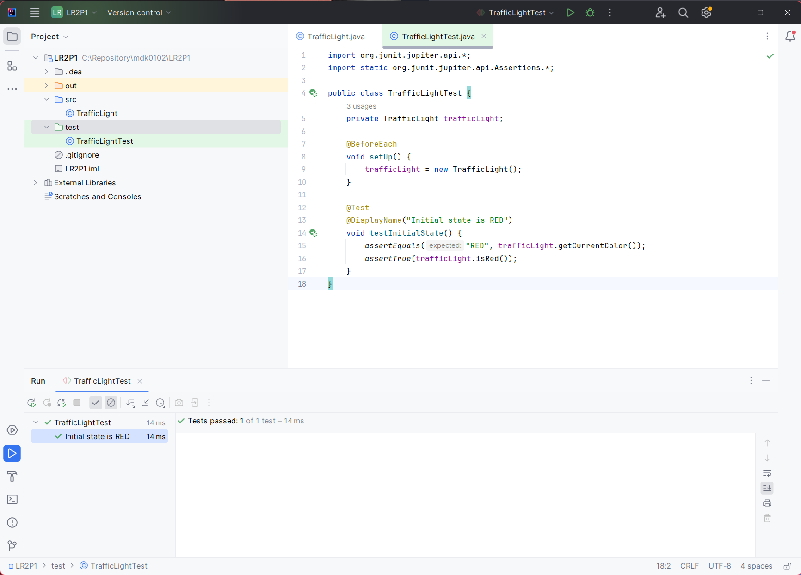
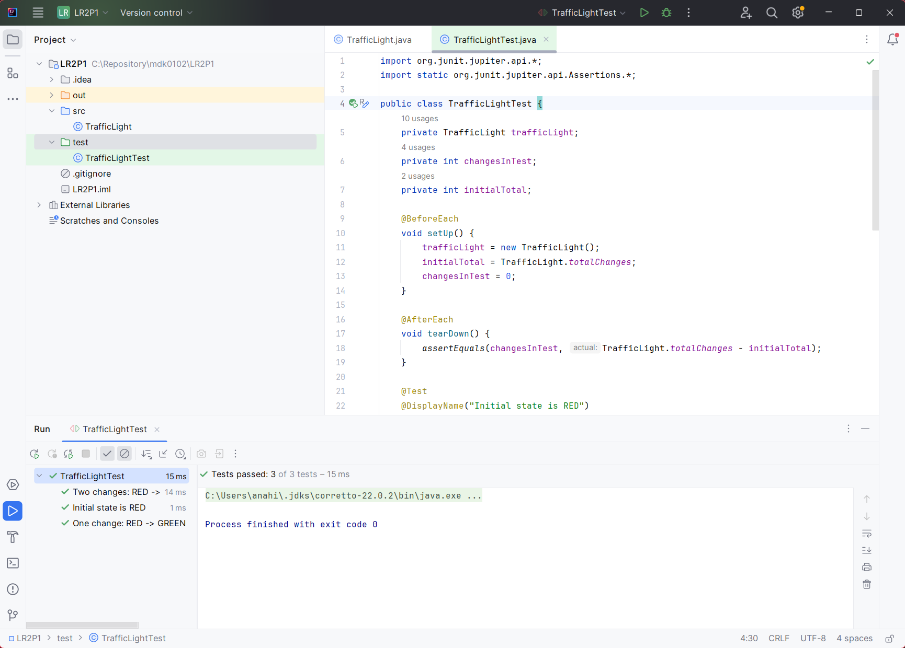
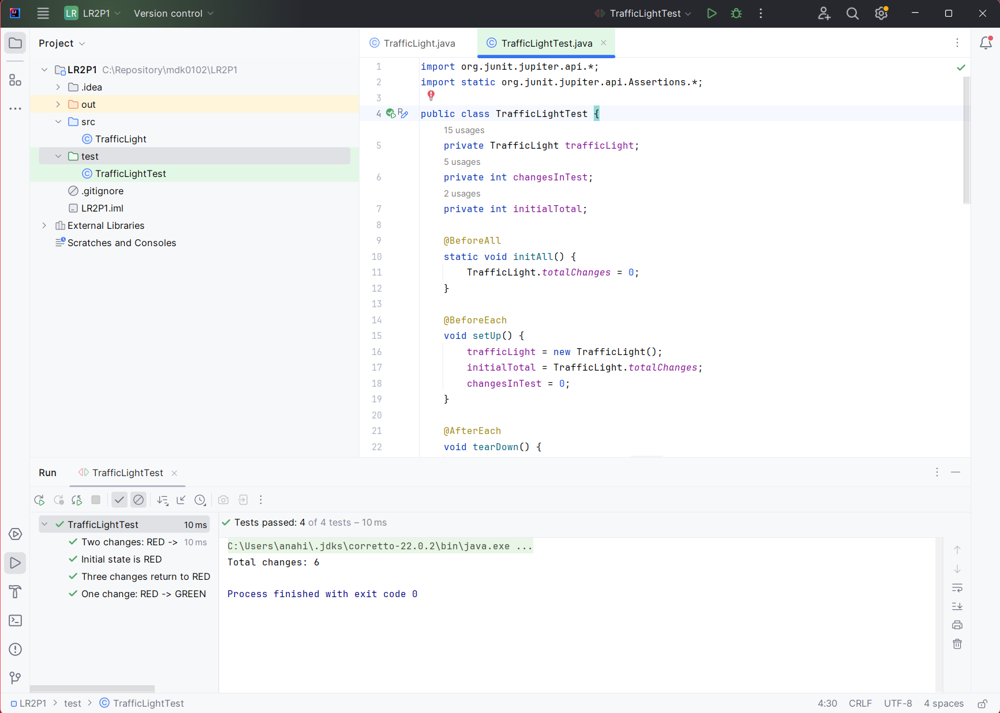
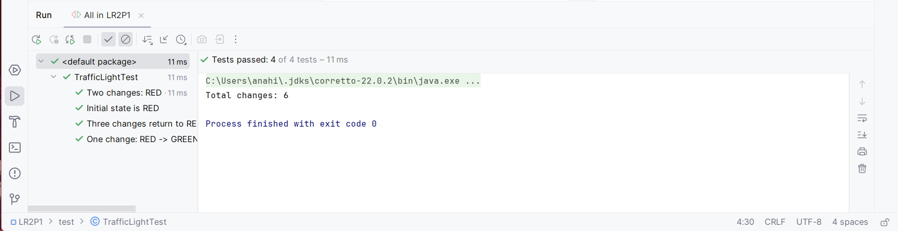
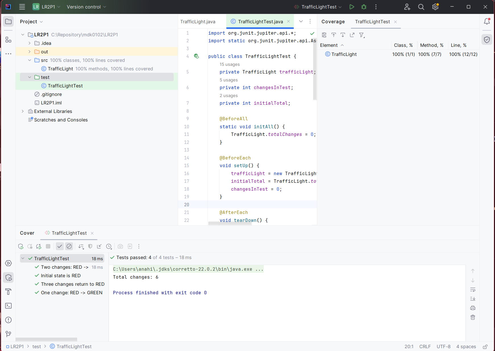

# Лабораторная работа №2_1: Тестовое окружение в JUnit

## 👨🎓 Студент
- **ФИО:** Анахин Даниил
- **Группа:** 247
- **Вариант:** 2 (Светофор)

---

## ✅ Выполненные задания

### Задание 1 (Простое)
**Тест:** Проверка начального состояния светофора (цвет RED, isRed() = true)

### Задание 2 (Среднее)
**Тесты:** 
- Переключение RED → GREEN
- Переключение RED → GREEN → YELLOW

### Задание 3 (Сложное)
**Тест:** Проверка статического счётчика totalChanges с использованием @BeforeAll, @BeforeEach, @AfterEach, @AfterAll

---

## 📊 Результаты

---

## 📎 Ссылки
- [Код тестов](LR2P1/test/TrafficLightTest.java)
- [Основной класс](LR2P1/src/TrafficLight.java)

*Дата: 11.03.2026*"# lab-junit-cycles-anahin" 
